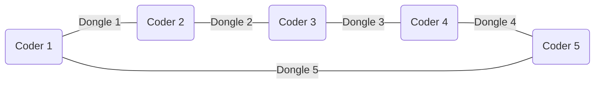

<div align="center">
    <i>This project has been created as part of the 42 curriculum by npillet</i>
    <h1>Codexion</h1>
    <h3>Master the race for resources before the deadline masters you</h3>
</div>

## Description
A thread is the smallest unit of processing that can be scheduled by an operating system. It is a sequence of instructions within a program that can be managed independently.<br>
Threads share the same process resources, including memory and file descriptors, but they run independently and can be executed simultaneously, allowing for multitasking within a single program.

A mutex is a MUTual EXclusion device, and is useful for protecting shared data structures from concurrent modifications, and implementing critical sections and monitors.<br>
A mutex has two possible states: unlocked (not owned by any thread), and locked (owned by one thread).<br>
A mutex can never be owned by two different threads simultaneously.

In this project, a defined numbers of coders are created and put in a circle. For each of them, a dongle is also created. These dongles are between each coders.<br>
Here is a visual representation:



Each coders is represented by a thread and needs two dongles to compile and this is where the challenge lies. For this project, the coders need to hit their target compile numbers before burning out. However, if one of them burns out before reaching its goal, the program stops.

Every action each coders take needs to be printed inside the terminal. Below is an exemple of the desired terminal output:
```bash
timestamp_in_ms X has taken a dongle
timestamp_in_ms X is compiling
timestamp_in_ms X is debugging
timestamp_in_ms X is refactoring
timestamp_in_ms X burned out
```

## Instructions
This first command compile the project:
```bash
make
```

To run the program, the command below can be used:
```bash
./codexion <number_of_coders> <time_to_burnout> <time_to_compile> <time_to_debug> <time_to_refactor> <number_of_compiles_required> <dongle_cooldown> <scheduler>
```

Here is a list of every parameters needed to run the program:

| Parameter | Limits | Description |
| --- | --- | --- |
| **number_of_coders** | Between 1 and 300 | The numbers of coders, and dongles. |
| **time_to_burnout** | Above or equal to 1 | The time limit a coder has before burning out (in milliseconds) |
| **time_to_compile** | Above or equal to 1 | The time a coder holds two dongles at once to compile (in milliseconds) |
| **time_to_debug** | Above or equal to 1 | The time a coder takes to debug (in milliseconds) |
| **time_to_refactor** | Above or equal to 1 | The time a coder takes to be able to code again (in milliseconds) |
| **number_of_compiles_required** | Above or equal to 1 |  |
| **dongle_cooldown** | Above or equal to 1 | The time a dongle to be used once again (in milliseconds) |
| **scheduler** | `fifo` (First In, First Out) or `edf` (Earliest Deadline First) | Choose the priority order of the coders |


## Blocking cases handled
*describing all the concurrency issues addressed in your solution (e.g., deadlock prevention and Coffman’s conditions, starvation prevention, cooldown handling, precise burnout detection, and log serialization).*

## Thread synchronization mechanisms
*explaining the specific threading primitives used in your implementation (pthread_mutex_t, pthread_cond_t, custom event implementation) and how they coordinate access to shared resources (dongles, logging, monitor state).*
*Include examples of how race conditions are prevented and how thread-safe communication is achieved between coders and the monitor.*


## Resources
### Notions
#### Threads
- https://dev.to/emanuelgustafzon/mastering-concurrency-in-c-with-pthreads-a-comprehensive-guide-56je

- https://www.geeksforgeeks.org/c/multithreading-in-c/

#### Mutex
- https://www.codequoi.com/en/threads-mutexes-and-concurrent-programming-in-c/#what-is-a-mutex-

#### FIFO (First In, First Out)
- https://dev.to/pmbanugo/write-your-own-fifo-queue-an-essential-data-structure-for-modern-systems-2kjn

- https://medium.com/@noransaber685/understanding-queue-data-structures-in-c-the-first-in-first-out-principle-fbd1f89d40dc

#### EDF (Earliest Deadline First)
- https://www.w3schools.com/dsa/dsa_data_binarytrees.php

- https://data-flair.training/blogs/binary-tree-in-c/

### GitHub
- [Overtek](https://github.com/Overtekk/Codexion)

- [buchy16](https://github.com/buchy16/Codexion)
