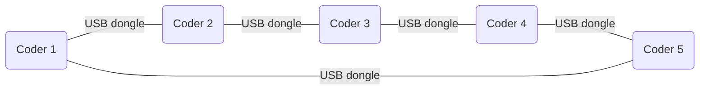

<div align="center">
    <i>This project has been created as part of the 42 curriculum by npillet</i>
    <h1>Codexion</h1>
    <h3>Master the race for resources before the deadline masters you</h3>
</div>

## Description
Thread, machin, machin
Mutex, bidule, bidule

le projet truc


parametre truc
`number_of_coders` (ont un nb de 1 a nb quils sont)<br>
`time_to_burnout` (ms)<br>
`time_to_compile` (ms)<br>
`time_to_debug` (ms)<br>
`time_to_refactor` (ms)<br>
`number_of_compiles_required`<br>
`dongle_cooldown` (ms)<br>
`scheduler` -> **fifo** (First In, First Out)
               **edf** (Earliest Deadline First avec deadline = last_compile_start + time_to_burnout)

output voulu
Any state change of a coder must be formatted as follows:
```bash
timestamp_in_ms X has taken a dongle
timestamp_in_ms X is compiling
timestamp_in_ms X is debugging
timestamp_in_ms X is refactoring
timestamp_in_ms X burned out
```

## Instructions
First, compile the project with:
```bash
make
```

Then run it:
```bash
./codexion <number_of_coders> <time_to_burnout> <time_to_compile> <time_to_debug> <time_to_refactor> <number_of_compiles_required> <dongle_cooldown> <scheduler>
```

## Blocking cases handled
*describing all the concurrency issues addressed in your solution (e.g., deadlock prevention and Coffman’s conditions, starvation prevention, cooldown handling, precise burnout detection, and log serialization).*

## Thread synchronization mechanisms
*explaining the specific threading primitives used in your implementation (pthread_mutex_t, pthread_cond_t, custom event implementation) and how they coordinate access to shared resources (dongles, logging, monitor state).*
*Include examples of how race conditions are prevented and how thread-safe communication is achieved between coders and the monitor.*


## Resources
### Notions
#### Multithreading
- https://www.geeksforgeeks.org/c/multithreading-in-c/

#### Mutex
- https://www.codequoi.com/en/threads-mutexes-and-concurrent-programming-in-c/#what-is-a-mutex-

#### FIFO (First In, First Out)
- https://dev.to/pmbanugo/write-your-own-fifo-queue-an-essential-data-structure-for-modern-systems-2kjn

