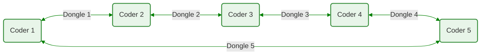
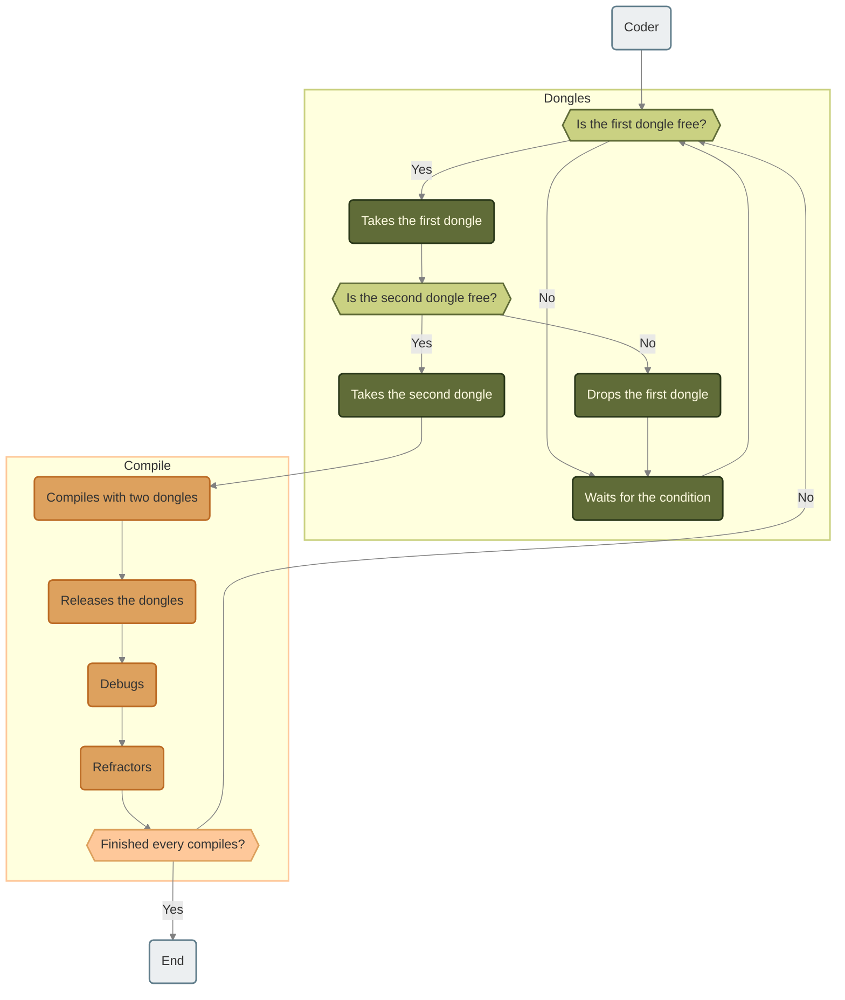
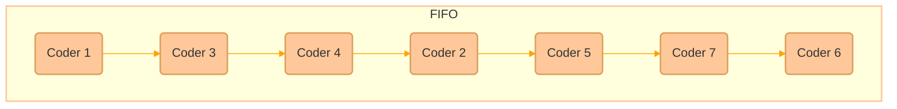
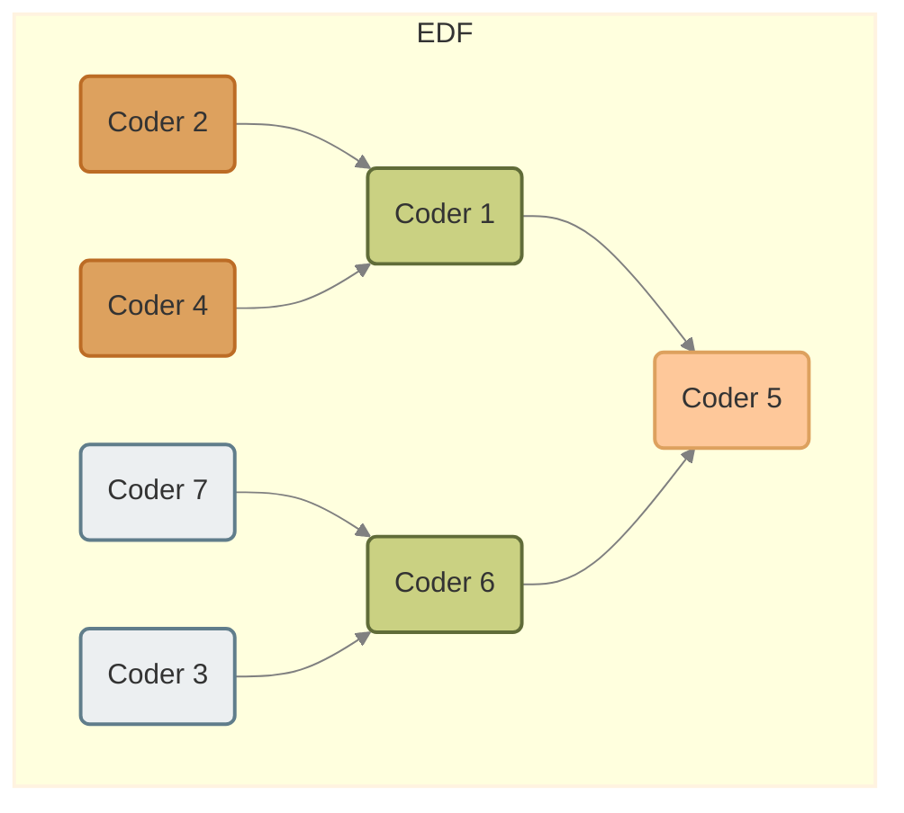

<div align="center">
    <i>This project has been created as part of the 42 curriculum by npillet</i>
    <h1>Codexion</h1>
    <h3>Master the race for resources before the deadline masters you</h3>
</div>

## Description
A **thread** is the smallest unit of processing that can be scheduled by an operating system. It is a sequence of instructions within a program that can be managed independently.<br>
Threads share the same process resources, including memory and file descriptors, but they run independently and can be executed simultaneously, allowing for multitasking within a single program.

A **mutex** is a **MUT***ual* **EX***clusion* device, and is useful for protecting shared data structures from concurrent modifications, and implementing critical sections and monitors.<br>
A mutex has two possible states: unlocked (not owned by any thread), and locked (owned by one thread).<br>
A mutex can never be owned by two different threads simultaneously.

In this project, a defined numbers of coders are created and put in a circle. For each of them, a dongle is also created. These dongles are between each coders.<br>
Here is a visual representation:



Each coders is represented by a thread and needs two dongles to compile and this is where the challenge lies. For this project, the coders need to hit their target compile numbers before burning out. However, if one of them burns out before reaching its goal, the program stops.

Every action each coders take needs to be printed inside the terminal. Below is an exemple of the desired terminal output:
```bash
timestamp_in_ms X has taken a dongle
timestamp_in_ms X is compiling
timestamp_in_ms X is debugging
timestamp_in_ms X is refactoring
timestamp_in_ms X burned out
```

## Instructions
This first command compile the project:
```bash
make
```

To run the program, the command below can be used:
```bash
./codexion <number_of_coders> <time_to_burnout> <time_to_compile> <time_to_debug> <time_to_refactor> <number_of_compiles_required> <dongle_cooldown> <scheduler>
```

Here is a list of every parameters needed to run the program:

| Parameter | Limits | Description |
| --- | --- | --- |
| **number_of_coders** | Between 1 and 300 | The numbers of coders, and dongles. |
| **time_to_burnout** | Above or equal to 1 | The time limit a coder has before burning out (in milliseconds) |
| **time_to_compile** | Above or equal to 1 | The time a coder holds two dongles at once to compile (in milliseconds) |
| **time_to_debug** | Above or equal to 1 | The time a coder takes to debug (in milliseconds) |
| **time_to_refactor** | Above or equal to 1 | The time a coder takes to be able to code again (in milliseconds) |
| **number_of_compiles_required** | Above or equal to 1 |  |
| **dongle_cooldown** | Above or equal to 1 | The time a dongle to be used once again (in milliseconds) |
| **scheduler** | `fifo` (First In, First Out) or `edf` (Earliest Deadline First) | Choose the priority order of the coders |

## Blocking cases handled
- **Deadlock Prevention**</br>
&emsp;To be able to prevent one, knowing Coffman's conditions can help. These conditions are listed below:
  - ***Mutual Exclusion***: At least one resource involved in each request is non-shareable
  - ***Circular Wait***: When a *coder a* holds a resource needed by *coder b*
  - ***Hold and Wait***: A task that's already holding one or more resources may request additional resources and wait while still holding the one(s) they have
  - ***No pre-emption***: Resources cannot be forcibly removed from a task, the release must be voluntary

</br>

- **Starvation Prevention**</br>
&emsp;This was handled differently depending on the scheduler.
  - In `FIFO`, a linked-list is used to put the coders in the wanted order.
  - In `EDF`, we use a binary tree to sort the coders by their burnout time, earliest being the first.

</br>

- **Cooldown Handling**</br>
&emsp;The dongles each have their cooldowns to respect. Once released, the data is refreshed using `dongle->cooldown = curr_time + data->dongle_cooldown`.

</br>

- **Precise Burnout Detection**</br>
&emsp;The monitor checks every milliseconds for a burnout while the simulation is active. If it finds out a coder burned out, the program stops right away.

</br>

- **Log Serialization**</br>
&emsp;For each log of either a coder or the monitor, a mutex for the print is locked for the time of the message's print.

</br>

## Thread synchronization mechanisms
Two kinds of thread synchronization mechanisms are used in this program to handle shared ressources such as dongles, logging and monitor state:
- `pthread_mutex_t`
  - This can be used to enable only one thread to access a shared ressource. While doing so, the mutex is locked to ensure only thread is using it. It is unlocked as soon as it is finished.
  - In the program, it was used to lock every shared ressources like dongles, their cooldown or the heap and the queue when making changes.

- `pthread_cond_t`
  - It is a condition used to put threads to sleep when necessary. You can wake the threads up when this condition is met.
  - `pthread_cond_wait` is used when the coder cannot proceed with the compiling process due to the lack of at least a dongle.
  - Once a coder has finished compiling, `pthread_cond_broadcast` is used to wake every coder (thread) and have them try to take two dongles to repeat the compiling process.

</br>
Below is a chart showing how a coder works:


If they reach their burnout during this loop, the entire program will stop.

The monitor will look over every coder present and check if one of them burned out, causing the program to come to an end.

In this program, the user has to choose a scheduler between `FIFO (First In, First Out)` and `EDF (Earliest Deadline First)`. They will determine in which order the coder goes.</br>
For `FIFO`, the coders are put in a queue based on a first come, first served logic. Once the first finishes a compile, it leaves the queue to enter it back in the last position.</br>
As for `EDF`, the coders are placed in a heap based on their burnout. Lowest one has priority and is therefore first.</br>
To visualize both schedulers, there is a side by side representation below with 7 coders:





## Resources
### Notions
#### Threads
- [pthread Functions](https://dev.to/emanuelgustafzon/mastering-concurrency-in-c-with-pthreads-a-comprehensive-guide-56je)

- [Multithreading](https://www.geeksforgeeks.org/c/multithreading-in-c/)

#### Mutex
- [What's a MUTEX?](https://www.codequoi.com/en/threads-mutexes-and-concurrent-programming-in-c/#what-is-a-mutex-)

#### Deadlock
- [What's a deadlock](https://stackoverflow.com/questions/34512/what-is-a-deadlock)

- [Coffman's Conditions](https://faq.computersciencewiki.org/index.php/home/article/coffman-conditions)

#### FIFO (First In, First Out)
- [FIFO's structure](https://dev.to/pmbanugo/write-your-own-fifo-queue-an-essential-data-structure-for-modern-systems-2kjn)

- [FIFO's principle](https://medium.com/@noransaber685/understanding-queue-data-structures-in-c-the-first-in-first-out-principle-fbd1f89d40dc)

#### EDF (Earliest Deadline First)
- [Binary Tree 1](https://www.w3schools.com/dsa/dsa_data_binarytrees.php)

- [Binary Tree 2](https://data-flair.training/blogs/binary-tree-in-c/)

### GitHub
- [Overtekk](https://github.com/Overtekk/Codexion)

- [buchy16](https://github.com/buchy16/Codexion)
